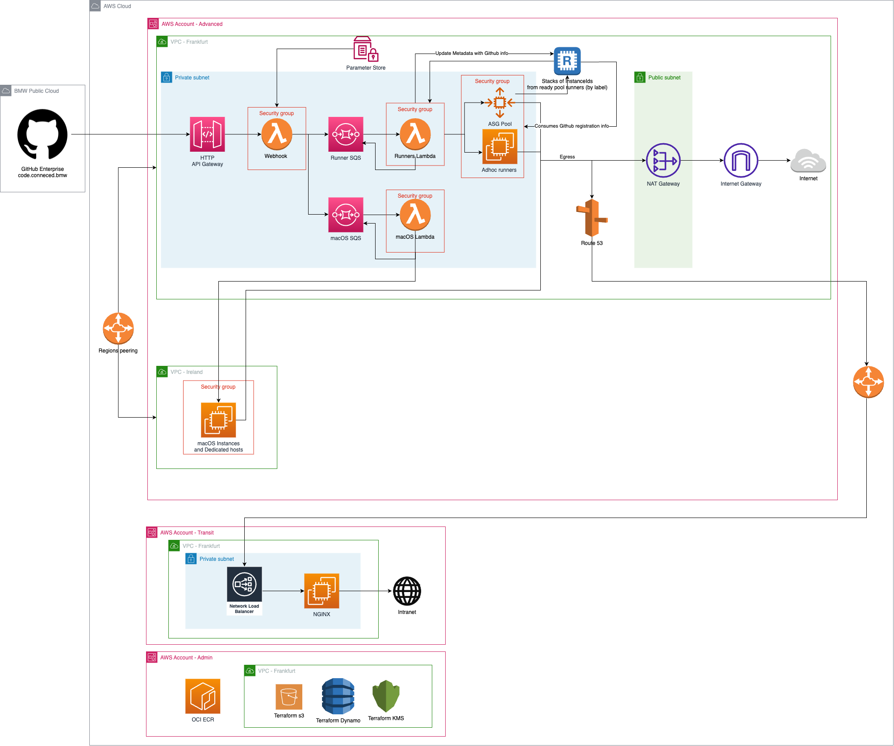
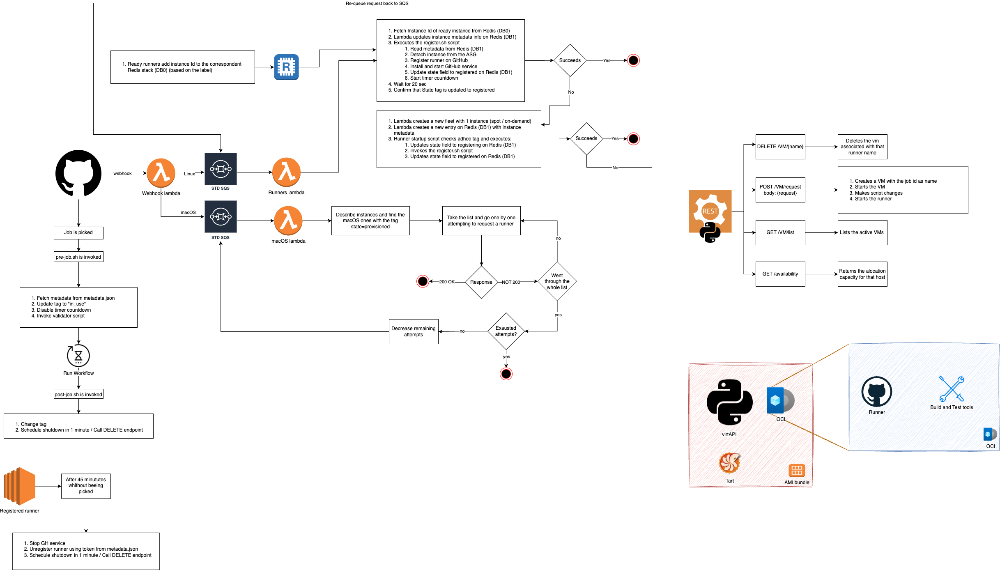

# CAWE - Accounts

This repository contains all AWS accounts needed to support our product infrastructure.

## Interface Contracts

Once Github jobs are picked by an available runner, `pre-job.sh` script implemented in the image AMI, makes a call to [cawe-api](https://code.connected.bmw/cicd/cawe-api) service to validate if the correspondent Github organization is one of the whitelisted ones in in the specificed IFC's. If not the Github job will fail and a message to contact CAWE team will be logged.

## System Architecture

This diagram provides an overview of the applied network and services and shows the current system architecture,
distributed over two AWS Accounts, and two GitHub Instances (ATC GitHub hosted on Azure, Orbit GitHub hosted on AWS).

## System Flow

This diagram provides an overview of the applied flow and logic.

## Lambdas

[Lambdas internal documentation](./lambda/README.md)

## How to Deploy From Scratch

[How to Deploy From Scratch](./documentation/DEPLOYMENT.md)

## How to Create a New Repository

[How to Create a New Repository](./documentation/REPOSITORIES.md)

## Troubleshooting

[Troubleshooting Guide](./documentation/TROUBLESHOOT.md)
