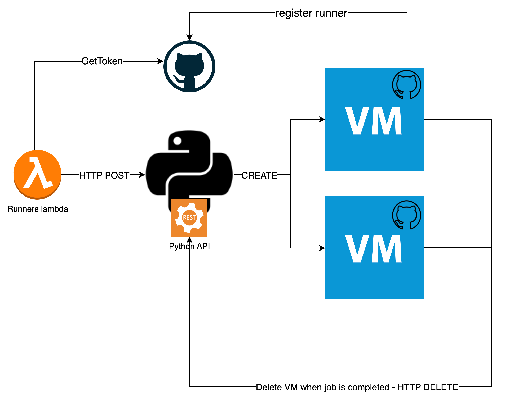
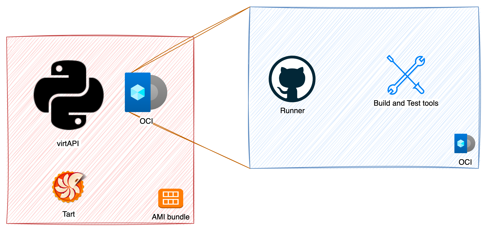

## Virtualization tool

This feature uses [Tart](https://tart.run/) as its virtualization tool. [Tart](https://tart.run/) is a virtualization toolset to build, run and manage macOS and Linux virtual machines on Apple Silicon. Tart itself is only responsible for managing virtual machines, but they've built Tart support into a tool called Cirrus CLI also developed by Cirrus Labs.

Since this runs on the native Apple virtualizartion framwork it is super fast to boot up new VMs. It has also two main drawbacks, it only runs on apple silicon and, because of licensing, the maximum number VMs per host is limited to 2

Tart documentation: <https://tart.run/vm-management/>

## API

To make use of this tool in a more controllable and resilient way a python API was created. This features an HTTP POST endpoint to create a vm, passing the parameters to both create the vm and configure the runner inside (preconfigured from the base image) as soon as the VM enters a valid boot state. Apart from that, the runner can be killed in the end of an execution simply executing the "suicide.sh" script, configured as a post execution hook on the runner. This script is copied at runtime with the private ip and job_id of that particular VM and contains a HTTP DELETE call to the API to terminate the VM.

## Images

Tart itself is just a wraper or a cli tool for Apple's Virtualization Framework therefore we need an image to create a VM. Tart uses OCI's as its image format which gives us the possibility to store then in a registry like ECR.

### **Build process**

1.  Find Apple's \*.ipsw recovery image link for the correspondent hardware used in AWS cloud services. https://ipsw.me/ is a good tool to find the correct link for the Apple CDN. (URL should look like this: "https://updates.cdn-apple.com/2023WinterFCS/fullrestores/032-66602/418BC37A-FCD9-400A-B4FA-022A19576CD4/UniversalMac_13.3.1_22E261_Restore.ipsw").
2.  Set temporary VM properties (CPU, RAM, etc).
3.  Configure VNC commands to walk through the boot UI
4.  Use packer provisioners to configure dependencies and build steps
5.  With the \*.pkr.hcl and variables.pkvars.hcl files created all its needed is to run the packer build command
6.  When this concludes (should take 30 minutes to one hour, depending on the amount of dependencies) we should see the new image when running "_tart list"_
7.  An aws cli profile needs to be setup using "credential_source = Ec2InstanceMetadata" to use the service role of the instance to access the ECR
8.  Then we should be able to login into the ECR issuing the AWS provided commands, replacing docker with tart
9.  The final step is just pushing the OCI to the ECR: "*tart push* ..."

**NOTE**: Environment variables must be set at~/.zshenv instead of ~/.zprofile.

To ease the deployment and scaling of these tools as bundle containing the API, tart and a boot script was created.

To build the AMI bundler packer was used, following a similar process:

1.  Get the lastest macOs AMI
2.  Copy the tools to it
3.  Install the API as a service
4.  Build it
