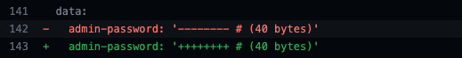
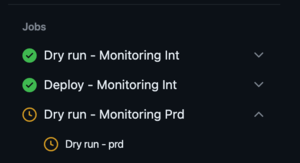
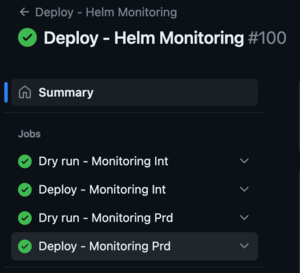

### **Overview**

This document describes how to deploy the [helm chart](https://helm.sh/) [cawe-monitoring](../helm/cawe-monitoring) on the K8s cluster.

## **Introduction**

Our monitoring stack is mostly implemented in the Kubernetes cluster through [helm chart](https://helm.sh/) [cawe-monitoring](../helm/cawe-monitoring).
Through this stack, we monitor our runners, AWS resources, our and third-party endpoints and we also collect FinOps metrics.

## **Environments**

Int (Integration): We have the **051351247033** account, where there is the **cawe-int** k8s cluster managed by orbit-infra that hosts our monitoring-related applications. In this account, we can test the changes before applying them to production.

Prd (Production): We have the **641068916226** account, where there is the **cawe-prd** k8s cluster managed by orbit-infra that hosts our monitoring-related applications. In this account, we have all the important metrics.
We even receive metrics from DEV and INT runners when we are testing from the steam-roller org.

### **Automation**

The [Deploy - Helm Workflow](../.github/workflows/deploy-helm.yml) was created to perform this process.

### **Deploy process**

Workflow trigger conditions: push to main by Pull Request and changes files into the [helm folder](../helm).

The [Deploy - Helm Workflow](../.github/workflows/deploy-helm.yml) is divided as follows:

- **Dry run - Monitoring Int**: In this job we will dry-run the chart update or installation in a Disaster Recovery/K8s cluster migration case.
  In addition to the dry-run, a diff of the changes will be made to make it easier to see what will be changed, it is a way to bring more confidence to those carrying out the deployment.

- **Deploy - Monitoring Int**: The deployment will start right after the plan. Will be executed the command with `helm upgrade --install` with their respective parameters, this means that an update will be made to the chart and if the chart is not installed, it will be installed.

- **Dry run - Monitoring Prd**: In this job we will dry-run the chart update or installation in a Disaster Recovery/K8s cluster migration case.
  In addition to the dry-run, a diff of the changes will be made to make it easier to see what will be changed, it is a way to bring more confidence to those carrying out the deployment.
  An important point is that approval is required for production and this step will begin after the INT environment is finished.

- **Deploy - Monitoring Prd**: The deployment will start right after the plan and **approve**. Will be executed the command with `helm upgrade --install` with their respective parameters`, this means that an update will be made to the chart and if the chart is not installed, it will be installed.

Looking to the changes:

On the step **Helm diff**, we can analyze the differences better with color differentiation.

Note the approval is request for prd environment:

If everything runs well, you will receive the status "green" at the end.

