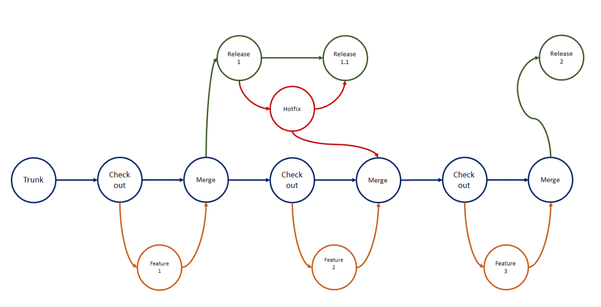

## **Overview**

This document describes the evaluation of Development Flow best practices to be used in CAWE - Continuous Automation Workflow Enabler, which focuses on providing infrastructure and guidance for GitHub Actions. This documentation is to provide insight on the development workflow for the CAWE team, and to engage discussions on what development strategies work best for the team.

## **Introduction**

The CAWE team enables the provisioning of efficient and economical infrastructure to build validate and deploy in a continuous manner. Therefore we need to adopt a development flow that allows us to build and deploy in an efficient and continuous manner. The team has opted to go with the Trunk Based Development

**_Trunk Based Development_**

Trunk Based Development is a branching model in which developers create short-lived feature branches and merge back into the "trunk" branch, often called as the master branch.

The guiding principals of Trunk Based Development

- There is one "trunk" branch where developers merge their changes.
- Developers should merge small changes as often as they can.
- Merges must be reviewed, tested, and must not destroy the "trunk".
- All code in "trunk" must be release ready at all times.
- Feature branches must be short-lived.
- Keep your commit messages as concise as possible

In this strategy, we have the only one branch

1.  Trunk/Master/Main: This contains the production ready code, and where deployment to all environments go through. All other branches are temporary and short lived, and features should go into production at least every day. This development workflow relies on automated testing, test driven development and high automation. This is also the best development workflow for continuous deployment.
2.  In a trunk-based workflow, the main branch should always be production-ready. Faulty code can break the entire build and result in a complicated development history. That means that teams should thoroughly test each code change before pushing them to the main branch. Short development cycles and automated testing enable teams to identify defects and recover from failed builds quickly, reducing the risk.

3.  Using the trunk-based workflow requires that there are experienced developers on the team. Junior or inexperienced members need a sufficient understanding of the workflow before they can contribute to the project.

## **Branch Naming**

We are looking to adopt the following branch naming standards to keep it simple for now:

**<ticket_number>+, eg.: **CAWE-2

## **Commit Conventions**

We will use Conventional Commits as much as possible:

<type>[optional scope]: <description>

**type**:

- fix
- feat
- build
- ci
- refactor
- docs
- ...and others

_References:_

Angular convention: <https://github.com/angular/angular/blob/22b96b9/CONTRIBUTING.md#-commit-message-guidelines>

Conventional Commits: <https://github.com/conventional-changelog/commitlint/tree/master/%40commitlint/config-conventional>

## **Recommendation**

We adopted the Trunk Based Development to avoid multiple permanent branches. Also because the team is new, we can collaborate in terms of Pull Requests (PR) before a merge to master.

We also adopt the branch naming strategy to give an immediate idea of what is being worked on. Commit messages will be based on [Conventional Commits](https://www.conventionalcommits.org/en/v1.0.0/#summary) as much as possible.