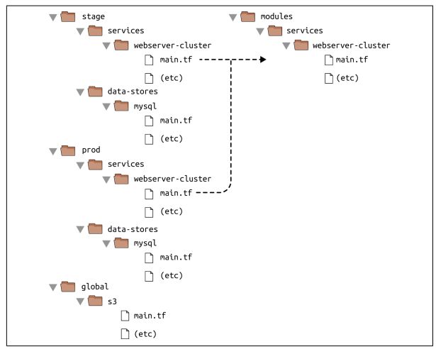

Please keep in mind that you are reading a **1st version of this process, **which is subject to change or improve overtime.

This document describes the evaluation of Terraform patterns to be used in CAWE - Continuous Automation Workflow Enabler, which focuses on providing infrastructure and guidance for GitHub Actions.

# Types of Terraform Patterns

---

### Single files

Typically used for small and simple projects.

These include all the configuration needed to spin-up the environment including variables, resource definitions and configuration specifics

Example:

- **terraform.tf**

### Multiple files

Typically used tor medium projects in size and complexity.

Similarly as single files above, these also include variables, resource definitions and configuration specifics, but in this case each file configures a specific part of the project.

Example:

- **vm.tf**
- **firewall.tf**
- **site.tf**

# Modules

### Module Conventions

Standard module structure

- Start with main.tf
- Create logical groups of resources with their own files and descriptive names like **network.tf**,** instances.tf**
- Include a **README.md**, **CHANGELOG.md** and **CODEOWNERS** file if necessary
- Provide further documentation on **/docs** subfolderC
- Provide examples if applicable, place them in **/examples** subfolder

Naming convention

- Name all object using underscores to delimit multiple words (consistency with terraform conventions)
- Make all resource names singular
- Do not repeat the resource type in the resource name
- If a resource is the only one of it's type, name it **main**
- Give descriptive names
  - Add units to variable name (**\*\_gb** for gigabyte)
  - Give boolean variables positive names (**enable_external_access**)

Variables

- Declare all expected variables of each module in** variables.tf**
- Use a global **variables.tvars** file to with the values that should be overridden on all **variables.tf**
- Variables must have defined types
- Variables must have descriptions
- Default values
  - Should be pre-configured on **variables.tf** if existent
  - For environment independent values, provide default values (ex. disk size)
  - For environment dependent values do not provide default values
- Only use variables if there is a concrete use case of parametrization

Outputs

- All outputs of each module should be configured in a **outputs.tf **file
- Output all useful values that composable modules might need
- Data sources
  - Use a dedicated **data.tf** file if absolutely necessary
- Custom scripts
  - Used only if absolutely necessary
  - Should be placed in a **/scripts** subfolder
- Formating
  - Use built-in formatting** terraform fmt**

### Modules relationship

Reusable Modules (Building blocks) → Composable configurations

- Module Composition takes multiple composable building-block modules
- Only one level of composition should be used
  - Changes on child modules require version bump
  - Adding new variables or changes on outputs also requires parent modules to be updated to handle those
  - Having more than one level of composition is not recommended as best practice by most companies

### Reusable Modules

- Released tagged versions
- Do not declare providers or backends
- Expose labels as a variable (to extend module owned labels)
- As granular as possible avoiding inline blocks

### Composable Modules

- Minimize the number of resources in each module
- Follow scoping guidelines
  - Only deploy together what belongs together (Couple / Decouple)
  - Rely on **outputs **and **data sources**
- Should act as blueprints
- Often used to configure company specifics
- Allows to group resources in a functional / high availability way in case it's necessary (Group of worker nodes of a k8s cluster for example)

### Documentation

- Document all inputs and outputs
- Consider using a CLI tool to generate docs: <https://terraform-docs.io/>

# Resources

---

- [1] HashiCorp Learn: Module Creation -- Recommended Pattern\
  <https://learn.hashicorp.com/tutorials/terraform/pattern-module-creation>
- [2] Terraform Language: Module Composition\
  <https://www.terraform.io/language/modules/develop/composition>
- [3] Google Cloud: Best practises for using Terraform\
  <https://cloud.google.com/docs/terraform/best-practices-for-terraform>
- [4] Getbetterdevops: How to Create Terraform Multiple Environments\
  <https://getbetterdevops.io/terraform-create-infrastructure-in-multiple-environments>
- [5] Terraform: Up and Running, Second Edition by Yevgeniy Brikman (O'Reilly)\
  Copyright 2019 Yevgeniy Brikman, 978-1-492-04690-5.
