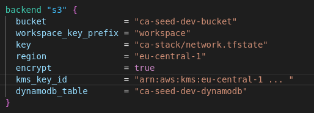
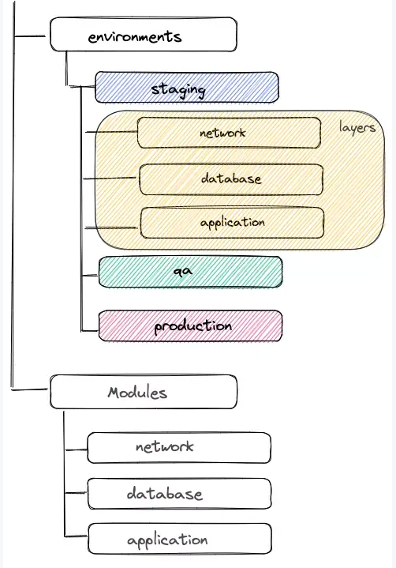
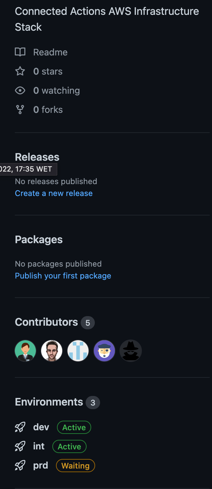

This document describes the evaluation of Workspaces & Environment best practices to be used in CAWE - Continuous Automation Workflow Enabler, which focuses on providing infrastructure and guidance for GitHub Actions.

## **Dealing with State (Terraform Remote State)**

Terraform needs to store state regarding to the infrastructure and configuration, in order to store bindings between objects in a remote system and resources declared in the configuration. Usually, the state file is named terraform.tfstate, but can be changed if necessary.

The state can be two types: **local** or **remote**. Generally, local files is often used when the work is done only by one person. This happens because it's harder to make sure everyone in the teams is using the latest version of state before running Terraform and that no one else is running at the same time. For this reason, within a team environment, remote state is the best solution.

Using remote state, enables Terraform to write the state information to a remote data store, which allows it to be shared by all team members. There are several options for storing remote state, such as **Terraform Cloud,** **HashiCorp Consul,** **Amazon S3,** **Azure Blob Storage**, and others.

For our specific case, the best approach is use a remote state based in Amazon S3, since we will have several resources of our product based in this public Cloud. To define that we need to create three elements:

- **S3 Bucket**: store the Remote State of all subsequent Terraform configurations, with all of the appropriate security configurations;
- **DynamoDB**: supports state locking and consistency checking, the state locking is what prevent two people from changing the infrastructure at the same time;
- **KMS Key**: enables the encryption of the state bucket.

To accomplish this, first we need to create the mentioned resources, and after that, we need to configure our backend similar to the one that is represented in the figure below.

It's also important to refer the key parameter corresponds to the path to the state file inside the bucket.

## **Dealing with different regions/ environments/ deployment groups**

Create an infrastructure only in a singular environment is a quite simple task, but in real world, usually we have to deal with several environments like **development**, **stage** and **production**. In order to accomplish that, two different approaches in order to create multiple environments: separated directories or one unique directory with multiple workspaces.

###    1.  Separated Directories 

With this structure, each environment has its directory that contains layers. The key where the state is stored depends according to the environment and the layer.

###     2. Workspaces

Contains everything Terraform needs to manage a given collection of infrastructure, and separate workspaces function like completely separate working directories. Also isolate the **terraform.tfstate** file from other workspaces in the same backend.

                                 

3. Environments

The team decided to start simple we will choose this environment workflow:

development
integration
production
You can configure environments with protection rules and secrets. A workflow job that references an environment must follow any protection rules for the environment before running or accessing the environment's secrets.

Environments are used to describe a general deployment target like production, integration, or development. When a GitHub Actions workflow deploys to an environment, the environment is displayed on the main page of the repository.

