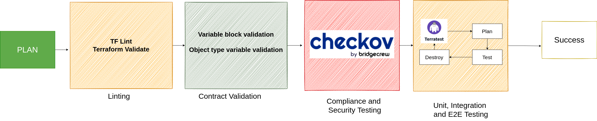

This document describes the evaluation of infrastructure Testing best practices to be used in CAWE - Continuous Automation Workflow Enabler, which focuses on providing infrastructure and guidance for GitHub Actions.

## What is and why do we need to test our infrastructure?

Everyone likes automation, it completely changes what can and can't be done in a given time frame, but automation can't do everything and sometimes fixes are needed.  When introducing these, we need a way of knowing if that really fixed the problem, if no other bug rose and at the end, we don't know what "fixed"  really means. Testing is the way to solve these problems, by ensuring that the final product is stable, compliant and easy to work on.

Automated tested software delivery results in:

- Less Production failures and Downtime
- Faster deployments
- Reduced operations costs and risk
- Greater service quality
- Overall better user experience

## What are the different steps to achieve a tested deployment?

Testing involves multiple steps, them being **static analysis**, **unit tests**, **Integration tests** and finally **End-to-End tests** in crescent order of cost.

All those steps should be executed by a specific order, so the more complex only execute once the previous, less expensive tests had run. By doing so, we can detect the issues early on, reducing costs.

- **Static testing** is software testing which is used to check defects in software application **without executing the code**. They are done to avoid errors at an early stage of development, as it is easier to identify and solve errors. Some examples are Linting, Contract and Compliance validations
- **Unit testing** is a software testing method by which **individual units of source code** (sets of one or more modules together with associated control data, usage procedures, and operating procedures) are tested individually.
- **Integration testing** is intended to **test all the code**. These tests validate that the newly introduced code does not break the existing code.
- **End-to-End** **testing** validates that everything works together before deploying to production. **It is the complete test of the whole process as a user would experience it.**

## What tools can help us realize those steps?

To perform Static Tests:

- Terraform-Compliance
- Hashicorp Sentinel
- Terrascan
- TFSec

To perform Unit Tests:

- Terratest

To perform Integration Tests:

- Terratest
- The Terraform provider [`apparentlymart/testing`](https://registry.terraform.io/providers/apparentlymart/testing/latest)

To perform End-to-End Tests:

- Terratest
- Scripts

## Proposed solution

Considering the tools mentioned above, the following image represents the desired flow to achieve a tested product.

To detect errors early on, a validation and linting step was thought. Apart from that, the variables should have contract rules, for example, to validate naming conventions or values with REGEX expressions:

> variable "just_a_test_var" {\
>  .....\
>  **validation {**\
> **   condition     = var.a > 0 && var.a < 5**\
> **   error_message = "The var must be between 1 to 5."**\
> ** }**\
> }

**Checkov** was preferred over **Sentinel** and **TerraScan** due to the lack of complexity when creating new custom checks (it uses python) and also because of the larger database of built-in tests. It is also better to perform analysis on multi-resource rules and to interpreter the results, since it outputs to JSON, JUnit, XML, GH Markdown, providing remediation guides.

In the end, **Terratest**, a GO library can be used to test each Unit or module, test its integration with the system as a whole and then the final product. Some examples could be to test the responsiveness of a HTTP endpoint, SSH connection, validate the created resources directly with AWS and validating network configurations. Terratest supports multiple tools like Terraform, Packer, docker, K8s, etc

## When should we execute each test?

This diagram shows the desired order, but for some use cases, some tests can be run independently. For example, one may only do the last step (Unit, Int and E2E ), together or individually, on a branch merge or PR to save on time and resources.

If a service like Terraform Cloud was to be used, tools like Hashicorp Sentinel could be considered as an alternative for compliance testing since it would provide greater integration
