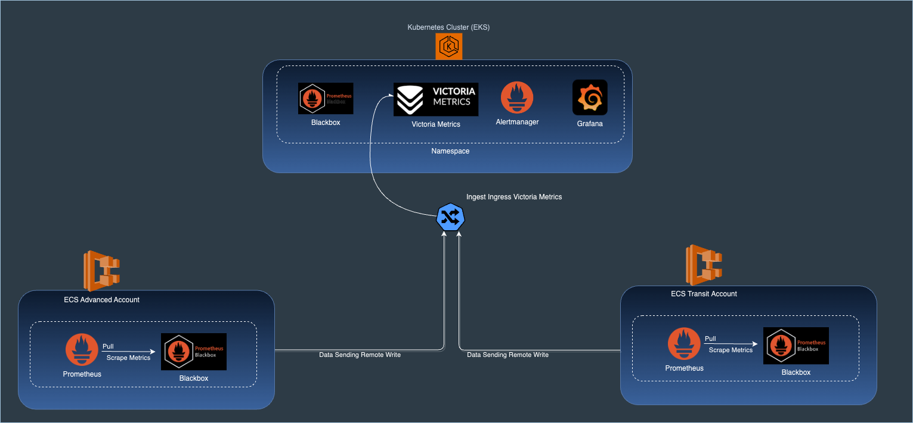

## **Overview**

This document describes the **endpoint-monitoring** setup and your build/deploy process.

## **Introduction**

For the Orbit Spaceship team, it is very important to have metrics on the main endpoints and also have visibility into the status of services supported by us and also by third parties.

## **Endpoint Monitoring**

For monitoring the main endpoints (Web Servers HTTP connections/Databases TCP connections) on the Orbit Spaceship environments we deployed the Stack [Victoria Metrics](https://victoriametrics.com/), [Prometheus](https://prometheus.io/) and [Blackbox exporter](https://github.com/prometheus/blackbox_exporter).
To simulate the real origin of the connections, we deployed most of this setup using [ECS](https://aws.amazon.com/ecs/) in each account where our runners and connections work (Advanced accounts and Default accounts).

Complementing this setup, on the "orbit-monitoring" account in Kubernetes Cluster provided by Orbit Infra Team, we deployed Blackbox exporter using the helm chart [cawe-monitoring](../../helm/cawe-monitoring).

Regarding the ECS cluster structure, we have a service that contains a task where we have two containers (Prometheus and Blackbox). Prometheus container scrapes metrics from the Blackbox exporter container using localhost connection and sends them to Victoria Metrics using remote write config.

The ECS infrastructure is deployed by Terraform through the [endpoint-monitoring module](../../modules/endpoint-monitoring). For the deploy the ECS on a new account is necessary call this module and define the property variables.

### **Strucuture Diagram**

The diagram of this setup.



Prometheus and blackbox within ECS form a kind of proxy that sends data to Victoria Metrics. Victoria Metrics has an ingress for data injection on EKS.
Regarding the blackbox exporter that is within the EKS cluster, the scraping is done using Victoria Metrics itself.

### **Build process**

The Dockerfile of each image are stored on repository [docker-images](https://code.connected.bmw/cicd/docker-images) on folder [endpoint-monitoring](https://code.connected.bmw/cicd/docker-images/tree/main/endpoint-monitoring).
The images are organized by application and environment.

To make the build and publish the images used by ECS cluster, actually you have to clone the repo [docker-images](https://code.connected.bmw/cicd/docker-images), and execute the following commands:

```bash
# Account Dev Advanced as example

# Local Build

cd endpoint-monitoring/dev/adv/blackbox

docker build -t cawe-blackbox:dev-adv .

# Push ECR

docker tag cawe-blackbox:dev-adv 831308554080.dkr.ecr.eu-central-1.amazonaws.com/cawe-blackbox:dev-adv

docker push 831308554080.dkr.ecr.eu-central-1.amazonaws.com/cawe-blackbox:dev-adv

cd endpoint-monitoring/dev/adv/prometheus

docker build -t cawe-blackbox:dev-adv .

# Push ECR

docker tag prometheus:dev-adv 831308554080.dkr.ecr.eu-central-1.amazonaws.com/cawe-prometheus:dev-adv

docker push 831308554080.dkr.ecr.eu-central-1.amazonaws.com/cawe-prometheus:dev-adv
```

> The CI/CD to deploy this setup is not created yet, will be created soon.
