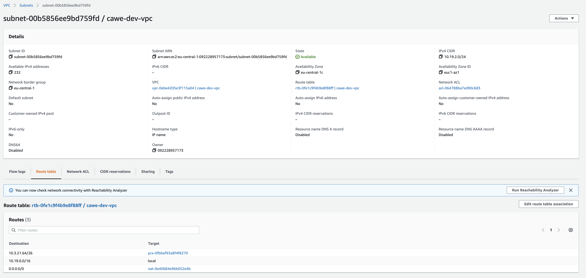
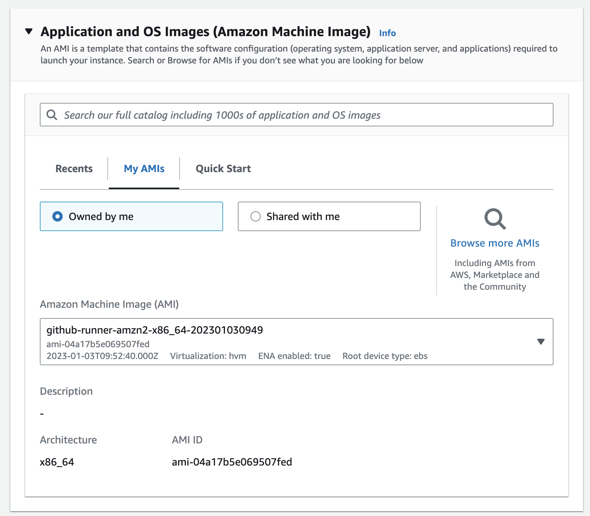
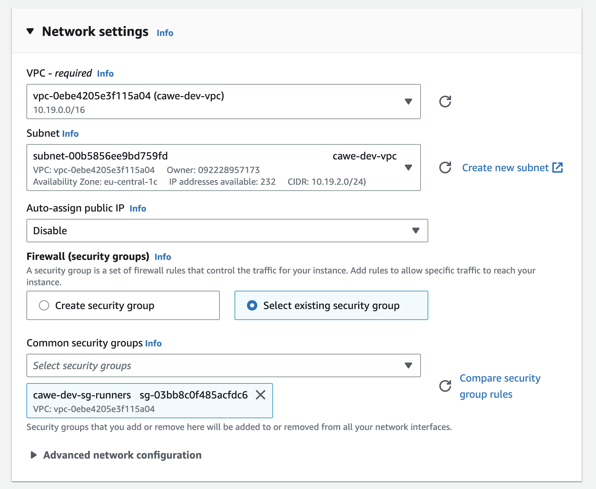
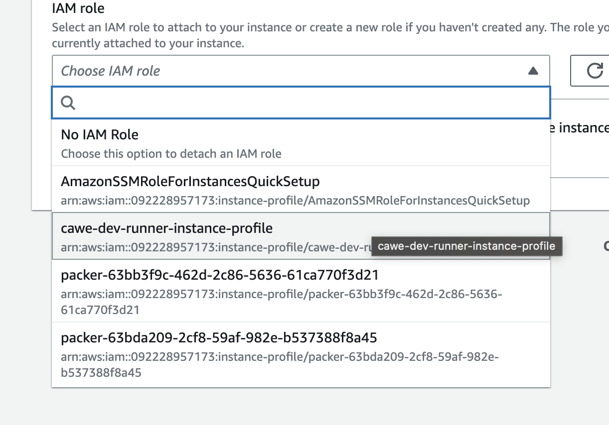
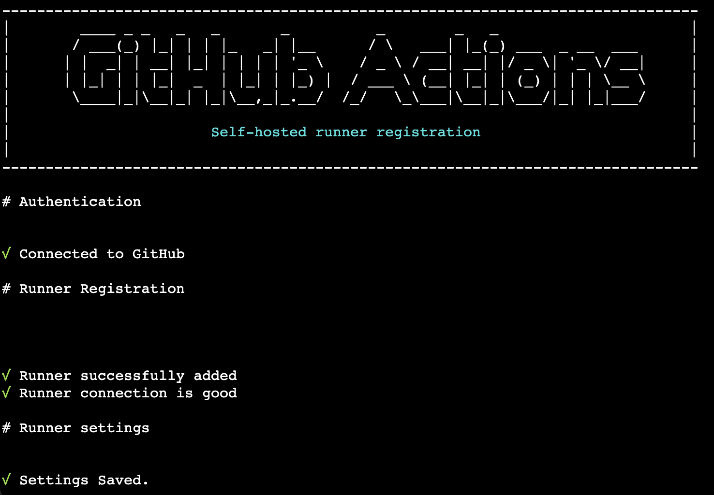

# Failover Solution

In case of an incident with CAWE logic to spinup new runners automatically, the safest way to guarantee the availability
of the service is to provision static runners.

## Spinup an AWS EC2 Instance Using Github Workflow

1. Open the [Failover workflow](../../.github/workflows/failover.yml) and run it with with the values accordingly with
   the target environment and Github organization

Dev Environment:

| Env  | Input             | Value                                              |
| ---- | ----------------- | -------------------------------------------------- |
| Dev  | ROLE_TO_ASSUME    | arn:aws:iam::092228957173:role/cawe/cawe-developer |
| Dev  | INSTANCE_TYPE     | t2.medium                                          |
| Dev  | SECURITY_GROUP_ID | sg-03bb8c0f485acfdc6                               |
| Dev  | SUBNET_ID         | subnet-00dbd54c2adfd6ecc                           |
| Dev  | ORG_URL           | https://code.connected.bmw/steam-roller            |
| Dev  | TOKEN             | AAABCQPR2UACJOOXP6WUFNLDZ2UGA                      |
| Dev  | LABELS            | cawe-linux-x64-general-medium                      |
| Int  | ROLE_TO_ASSUME    | arn:aws:iam::500643607194:role/cawe/cawe-developer |
| Int  | INSTANCE_TYPE     | t2.medium                                          |
| Int  | SECURITY_GROUP_ID | sg-01547384c47659b88                               |
| Int  | SUBNET_ID         | subnet-0acea43bedba0b3a1                           |
| Int  | ORG_URL           | https://code.connected.bmw/steam-roller            |
| Int  | TOKEN             | AAABCQPR2UACJOOXP6WUFNLDZ2UGA                      |
| Int  | LABELS            | cawe-linux-x64-general-medium                      |
| Prod | ROLE_TO_ASSUME    | arn:aws:iam::810674048896:role/cawe/cawe-developer |
| Prod | INSTANCE_TYPE     | t2.medium                                          |
| Prod | SECURITY_GROUP_ID | sg-0c039c967a1538efc                               |
| Prod | SUBNET_ID         | subnet-038f50835f6fa3e78                           |
| Prod | ORG_URL           | https://code.connected.bmw/steam-roller            |
| Prod | TOKEN             | AAABCQPR2UACJOOXP6WUFNLDZ2UGA                      |
| Prod | LABELS            | cawe-linux-x64-general-medium                      |

## Spinup an AWS EC2 Instance Manually

1. Open `VPC` page on AWS
2. Select `subnets` on the left panel
3. Iterate the details page of each subnet and search for one that has a `Route table` with a `nat` gateway (local)

   

4. Open `EC2` page on AWS
5. Click on `Launch Instances`

6. Add a name for the new instance

7. On `Application and OS Images (Amazon Machine Image)` menu:

   - Open `My AMI` tab and select the most recent one

   

8. On `Instance Type` menu:

   - Select the desired instance type

9. On `Key pair (login)` menu:

   - Select `Proceed without a key pair`

10. On `Network settings` menu:

    - Select the `VPC` with the name that contains the nat gatewway refered above
    - Select the `subnet` refered above
    - Set `Auto-assign public IP` as `Disabled`
    - Select `Select existing security group` in Firewall
    - Select a security group with the name `cawe-<env>-sg-runners`

    

11. On `Configure storage` menu:

    - Leave the default values

12. On `Advanced settings` menu:

    - Leave the default values

13. Create on `Launch instance`

14. Go back to EC2 Instances list and select the new instance
15. After it has become ready click on `Actions` -> `Modify IAM Role`

16. Select `cawe-<env>-runner-instance-profile`

    

17. Back on instance details page click on `Connect`
18. On `Connect to instance` menu:
    - Select `Session Manager` tab and click on `Connect`

## Disable Suicide Script (and IFC validation)

1. Open `/etc/gha/.env` file
2. Comment these lines accordingly:

   ```
   #ACTIONS_RUNNER_HOOK_JOB_STARTED=/etc/gha/validator.sh
   #ACTIONS_RUNNER_HOOK_JOB_COMPLETED=/etc/gha/suicide.sh
   ```

## Register the instance on Github Organization

1. Open `Settings` page of the target Github organization
2. Open `Actions` -> `Runners` tab
3. Cick on `New runner` button
4. Select `Linux`
5. Copy `./config.sh --url <org_url> --token <token>`
6. Add `--unattended` and `--labels` with the desired label and save it to be used later

   Example:

   ```
   ./config.sh --url <org_url> --token <token> --unattended --labels cawe-linux-x64-general-medium
   ```

   

7. Run `export RUNNER_ALLOW_RUNASROOT=1`
8. Run `config.sh` command from step 6.
9. Run `sudo ./svc.sh install`
10. Run `sudo ./svc.sh start`
