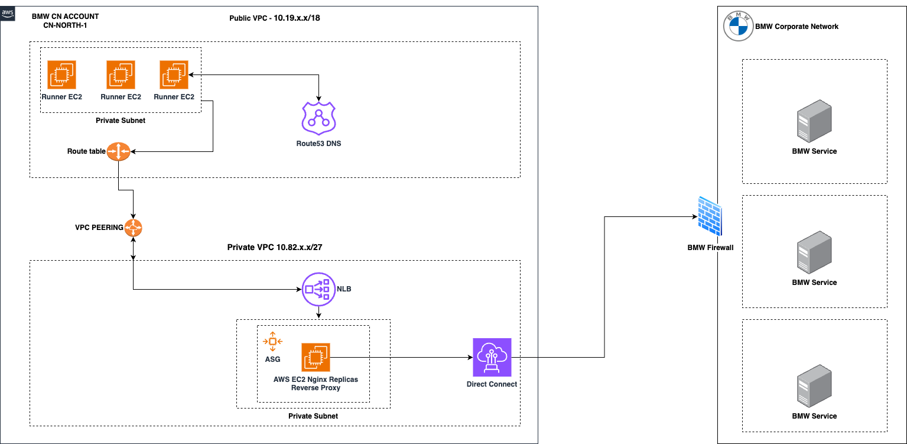

## About

This module deploys Nginx as a reverse proxy for BMW Intranet and creates Nat Gateway resources to enable runners to access the Internet.

Essential services like ATC Github, API Contract Validator, Compass and other BMW services can be accessed by runners through the BMW Intranet using the configured architecture.

## BMW Requirements

In order to reach BMW internal resrouces we need to request port whitelist. 
For that we need to open a Tufin request - https://tufin.bmwgroup.net

<!-- BEGIN_TF_DOCS -->
## Requirements

No requirements.

## Providers

| Name | Version |
|------|---------|
|  [aws](#provider\_aws) | n/a |

## Modules

No modules.

## Resources

| Name | Type |
|------|------|
| [aws_autoscaling_attachment.nginx](https://registry.terraform.io/providers/hashicorp/aws/latest/docs/resources/autoscaling_attachment) | resource |
| [aws_autoscaling_group.asg-nginx](https://registry.terraform.io/providers/hashicorp/aws/latest/docs/resources/autoscaling_group) | resource |
| [aws_eip.eip](https://registry.terraform.io/providers/hashicorp/aws/latest/docs/resources/eip) | resource |
| [aws_launch_template.nginx](https://registry.terraform.io/providers/hashicorp/aws/latest/docs/resources/launch_template) | resource |
| [aws_lb.direct_vpc1](https://registry.terraform.io/providers/hashicorp/aws/latest/docs/resources/lb) | resource |
| [aws_lb.nginx](https://registry.terraform.io/providers/hashicorp/aws/latest/docs/resources/lb) | resource |
| [aws_lb_listener.direct_vpc1](https://registry.terraform.io/providers/hashicorp/aws/latest/docs/resources/lb_listener) | resource |
| [aws_lb_listener.nginx](https://registry.terraform.io/providers/hashicorp/aws/latest/docs/resources/lb_listener) | resource |
| [aws_lb_target_group.direct_vpc1](https://registry.terraform.io/providers/hashicorp/aws/latest/docs/resources/lb_target_group) | resource |
| [aws_lb_target_group.nginx](https://registry.terraform.io/providers/hashicorp/aws/latest/docs/resources/lb_target_group) | resource |
| [aws_lb_target_group_attachment.direct_vpc1](https://registry.terraform.io/providers/hashicorp/aws/latest/docs/resources/lb_target_group_attachment) | resource |
| [aws_nat_gateway.nat_gw](https://registry.terraform.io/providers/hashicorp/aws/latest/docs/resources/nat_gateway) | resource |
| [aws_route53_record.default_records](https://registry.terraform.io/providers/hashicorp/aws/latest/docs/resources/route53_record) | resource |
| [aws_route53_record.direct_records_vpc1](https://registry.terraform.io/providers/hashicorp/aws/latest/docs/resources/route53_record) | resource |
| [aws_route53_vpc_association_authorization.this_cn-north-1-private](https://registry.terraform.io/providers/hashicorp/aws/latest/docs/resources/route53_vpc_association_authorization) | resource |
| [aws_route53_vpc_association_authorization.this_cn-north-1-private-1](https://registry.terraform.io/providers/hashicorp/aws/latest/docs/resources/route53_vpc_association_authorization) | resource |
| [aws_route53_vpc_association_authorization.this_cn-north-1-public](https://registry.terraform.io/providers/hashicorp/aws/latest/docs/resources/route53_vpc_association_authorization) | resource |
| [aws_route53_zone.default](https://registry.terraform.io/providers/hashicorp/aws/latest/docs/resources/route53_zone) | resource |
| [aws_security_group.http-s-ingress](https://registry.terraform.io/providers/hashicorp/aws/latest/docs/resources/security_group) | resource |
| [aws_security_group.load_balancer_nginx](https://registry.terraform.io/providers/hashicorp/aws/latest/docs/resources/security_group) | resource |
| [aws_security_group.load_balancer_nginx_health_check](https://registry.terraform.io/providers/hashicorp/aws/latest/docs/resources/security_group) | resource |
| [aws_security_group.load_balancer_vpc1](https://registry.terraform.io/providers/hashicorp/aws/latest/docs/resources/security_group) | resource |
| [aws_vpc_endpoint.ec-dkr](https://registry.terraform.io/providers/hashicorp/aws/latest/docs/resources/vpc_endpoint) | resource |
| [aws_vpc_endpoint.ec2](https://registry.terraform.io/providers/hashicorp/aws/latest/docs/resources/vpc_endpoint) | resource |
| [aws_vpc_endpoint.ec2messages](https://registry.terraform.io/providers/hashicorp/aws/latest/docs/resources/vpc_endpoint) | resource |
| [aws_vpc_endpoint.ecr-api](https://registry.terraform.io/providers/hashicorp/aws/latest/docs/resources/vpc_endpoint) | resource |
| [aws_vpc_endpoint.s3](https://registry.terraform.io/providers/hashicorp/aws/latest/docs/resources/vpc_endpoint) | resource |
| [aws_vpc_endpoint.s3-cn](https://registry.terraform.io/providers/hashicorp/aws/latest/docs/resources/vpc_endpoint) | resource |
| [aws_vpc_endpoint.ssm](https://registry.terraform.io/providers/hashicorp/aws/latest/docs/resources/vpc_endpoint) | resource |
| [aws_vpc_endpoint.ssmmessages](https://registry.terraform.io/providers/hashicorp/aws/latest/docs/resources/vpc_endpoint) | resource |
| [aws_ami.nginx_ami](https://registry.terraform.io/providers/hashicorp/aws/latest/docs/data-sources/ami) | data source |
| [aws_caller_identity.current](https://registry.terraform.io/providers/hashicorp/aws/latest/docs/data-sources/caller_identity) | data source |
| [aws_partition.current](https://registry.terraform.io/providers/hashicorp/aws/latest/docs/data-sources/partition) | data source |
| [aws_region.current](https://registry.terraform.io/providers/hashicorp/aws/latest/docs/data-sources/region) | data source |
| [aws_route53_zone.hosted_zones](https://registry.terraform.io/providers/hashicorp/aws/latest/docs/data-sources/route53_zone) | data source |
| [aws_subnets.private_vpc_private_subnets](https://registry.terraform.io/providers/hashicorp/aws/latest/docs/data-sources/subnets) | data source |
| [aws_subnets.private_vpc_private_subnets-1](https://registry.terraform.io/providers/hashicorp/aws/latest/docs/data-sources/subnets) | data source |
| [aws_subnets.public_vpc_private_subnets](https://registry.terraform.io/providers/hashicorp/aws/latest/docs/data-sources/subnets) | data source |
| [aws_subnets.public_vpc_public_subnets](https://registry.terraform.io/providers/hashicorp/aws/latest/docs/data-sources/subnets) | data source |
| [aws_vpc.private_vpc](https://registry.terraform.io/providers/hashicorp/aws/latest/docs/data-sources/vpc) | data source |
| [aws_vpc.private_vpc-1](https://registry.terraform.io/providers/hashicorp/aws/latest/docs/data-sources/vpc) | data source |
| [aws_vpc.public_vpc](https://registry.terraform.io/providers/hashicorp/aws/latest/docs/data-sources/vpc) | data source |

## Inputs

| Name | Description | Type | Default | Required |
|------|-------------|------|---------|:--------:|
|  [ami\_name](#input\_ami\_name) | The name to give to the copied AMI. | `string` | n/a | yes |
|  [ami\_name\_prefix](#input\_ami\_name\_prefix) | The prefix to be added to the AMI name | `string` | `"transit"` | no |
|  [autoscaling\_name](#input\_autoscaling\_name) | Name of the autoscaling group | `string` | n/a | yes |
|  [common\_tags](#input\_common\_tags) | Project common tags | <pre>object({     environment  = string     project_name = string   })</pre> | n/a | yes |
|  [desired\_capacity](#input\_desired\_capacity) | Max number of nginx replicas | `number` | n/a | yes |
|  [distribution](#input\_distribution) | Set Linux distribution | `string` | n/a | yes |
|  [dns\_prefixes\_vpc1](#input\_dns\_prefixes\_vpc1) | Records to be created for supported private hosted zones | <pre>list(object({     hosted_zone   = string     subdomain     = string     load_balancer = string   }))</pre> | n/a | yes |
|  [environment](#input\_environment) | (Set by pipeline) Used to derive names of AWS resources. Use this to distinguish different enviroments | `string` | n/a | yes |
|  [group](#input\_group) | Naming prefix for all resources | `string` | n/a | yes |
|  [hosted\_zones](#input\_hosted\_zones) | List of supported private hosted zones | `list(string)` | n/a | yes |
|  [instance\_type](#input\_instance\_type) | Instance Type | `string` | n/a | yes |
|  [load\_balancers\_vpc1](#input\_load\_balancers\_vpc1) | List of Network Load Balancers to be created | `list(string)` | n/a | yes |
|  [max\_nginx\_size](#input\_max\_nginx\_size) | Max number of nginx replicas | `number` | n/a | yes |
|  [min\_nginx\_size](#input\_min\_nginx\_size) | Min number of nginx replicas | `number` | n/a | yes |
|  [nginx\_instance\_profile\_name](#input\_nginx\_instance\_profile\_name) | n/a | `any` | n/a | yes |
|  [nginx\_ports](#input\_nginx\_ports) | List of default Nginx ports to be forwarded | `list(number)` | n/a | yes |
|  [private\_vpc\_name](#input\_private\_vpc\_name) | The name of the private VPC | `string` | n/a | yes |
|  [private\_vpc\_name-1](#input\_private\_vpc\_name-1) | The name of the private VPC | `string` | n/a | yes |
|  [project\_name](#input\_project\_name) | Project Name of this deployment | `string` | n/a | yes |
|  [public\_vpc\_name](#input\_public\_vpc\_name) | The name of the public VPC | `string` | n/a | yes |
|  [region](#input\_region) | The region in which the vpcs are created | `string` | n/a | yes |
|  [target\_groups\_vpc1](#input\_target\_groups\_vpc1) | List of target groups to access BMW intranet services | <pre>list(object({     subdomain     = string     hosted_zone   = string     load_balancer = string     service_port  = string     service_ip    = string   }))</pre> | n/a | yes |
|  [worker\_connections](#input\_worker\_connections) | number of connections to be allowed to one nginx instance | `number` | `32767` | no |

## Outputs

| Name | Description |
|------|-------------|
|  [vpc\_cidr](#output\_vpc\_cidr) | n/a |
|  [vpc\_id](#output\_vpc\_id) | n/a |
|  [vpc\_private\_subnet\_ids](#output\_vpc\_private\_subnet\_ids) | n/a |
<!-- END_TF_DOCS -->
