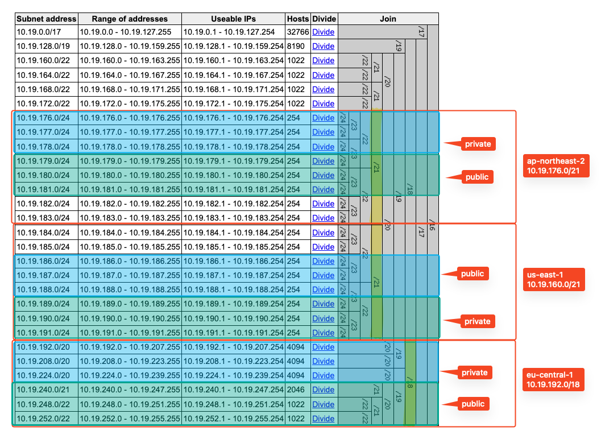

## VPC subnets

<!-- BEGIN_TF_DOCS -->
## Requirements

No requirements.

## Providers

| Name | Version |
|------|---------|
|  [aws](#provider\_aws) | n/a |
|  [aws.ap-northeast-2](#provider\_aws.ap-northeast-2) | n/a |
|  [aws.eu-west-1](#provider\_aws.eu-west-1) | n/a |
|  [aws.us-east-1](#provider\_aws.us-east-1) | n/a |

## Modules

| Name | Source | Version |
|------|--------|---------|
|  [peering\_ap-northeast-2](#module\_peering\_ap-northeast-2) | ../vpc-peering | n/a |
|  [peering\_eu-west-1](#module\_peering\_eu-west-1) | ../vpc-peering | n/a |
|  [peering\_us-east-1](#module\_peering\_us-east-1) | ../vpc-peering | n/a |
|  [vpc-ap-northeast-2](#module\_vpc-ap-northeast-2) | ./vpc | n/a |
|  [vpc-eu-central-1](#module\_vpc-eu-central-1) | ./vpc | n/a |
|  [vpc-eu-west-1](#module\_vpc-eu-west-1) | ./vpc | n/a |
|  [vpc-us-east-1](#module\_vpc-us-east-1) | ./vpc | n/a |

## Resources

| Name | Type |
|------|------|
| [aws_route53_zone.spaceship-bmw](https://registry.terraform.io/providers/hashicorp/aws/latest/docs/resources/route53_zone) | resource |
| [aws_route53_zone_association.ap-northeast-2](https://registry.terraform.io/providers/hashicorp/aws/latest/docs/resources/route53_zone_association) | resource |
| [aws_route53_zone_association.eu-west-1](https://registry.terraform.io/providers/hashicorp/aws/latest/docs/resources/route53_zone_association) | resource |
| [aws_route53_zone_association.us-east-1](https://registry.terraform.io/providers/hashicorp/aws/latest/docs/resources/route53_zone_association) | resource |
| [aws_caller_identity.current](https://registry.terraform.io/providers/hashicorp/aws/latest/docs/data-sources/caller_identity) | data source |
| [aws_partition.current](https://registry.terraform.io/providers/hashicorp/aws/latest/docs/data-sources/partition) | data source |
| [aws_region.current](https://registry.terraform.io/providers/hashicorp/aws/latest/docs/data-sources/region) | data source |
| [aws_route_tables.rts_ap-northeast-2](https://registry.terraform.io/providers/hashicorp/aws/latest/docs/data-sources/route_tables) | data source |
| [aws_route_tables.rts_eu-central-1](https://registry.terraform.io/providers/hashicorp/aws/latest/docs/data-sources/route_tables) | data source |
| [aws_route_tables.rts_eu-west-1](https://registry.terraform.io/providers/hashicorp/aws/latest/docs/data-sources/route_tables) | data source |
| [aws_route_tables.rts_us-east-1](https://registry.terraform.io/providers/hashicorp/aws/latest/docs/data-sources/route_tables) | data source |

## Inputs

| Name | Description | Type | Default | Required |
|------|-------------|------|---------|:--------:|
|  [environment](#input\_environment) | (Set by pipeline) Used to derive names of AWS resources. Use this to distinguish different enviroments | `string` | n/a | yes |
|  [group](#input\_group) | Naming prefix for all resources | `string` | n/a | yes |
|  [private\_subnets\_ap-northeast-2](#input\_private\_subnets\_ap-northeast-2) | Private subnets cidrs to use | `list(string)` | n/a | yes |
|  [private\_subnets\_eu-central-1](#input\_private\_subnets\_eu-central-1) | Private subnets cidrs to use | `list(string)` | n/a | yes |
|  [private\_subnets\_eu-west-1](#input\_private\_subnets\_eu-west-1) | Private subnets cidrs to use | `list(string)` | n/a | yes |
|  [private\_subnets\_us-east-1](#input\_private\_subnets\_us-east-1) | Private subnets cidrs to use | `list(string)` | n/a | yes |
|  [project\_name](#input\_project\_name) | Project Name of this deployment | `string` | n/a | yes |
|  [public\_subnets\_ap-northeast-2](#input\_public\_subnets\_ap-northeast-2) | Public subnets cidrs to use | `list(string)` | n/a | yes |
|  [public\_subnets\_eu-central-1](#input\_public\_subnets\_eu-central-1) | Public subnets cidrs to use | `list(string)` | n/a | yes |
|  [public\_subnets\_eu-west-1](#input\_public\_subnets\_eu-west-1) | Public subnets cidrs to use | `list(string)` | n/a | yes |
|  [public\_subnets\_us-east-1](#input\_public\_subnets\_us-east-1) | Public subnets cidrs to use | `list(string)` | n/a | yes |
|  [vpc\_cidr\_ap-northeast-2](#input\_vpc\_cidr\_ap-northeast-2) | VPC CIDR Block | `string` | n/a | yes |
|  [vpc\_cidr\_eu-central-1](#input\_vpc\_cidr\_eu-central-1) | VPC CIDR Block | `string` | n/a | yes |
|  [vpc\_cidr\_eu-west-1](#input\_vpc\_cidr\_eu-west-1) | VPC CIDR Block | `string` | n/a | yes |
|  [vpc\_cidr\_us-east-1](#input\_vpc\_cidr\_us-east-1) | VPC CIDR Block | `string` | n/a | yes |

## Outputs

| Name | Description |
|------|-------------|
|  [spaceship-bmw\_zone\_id](#output\_spaceship-bmw\_zone\_id) | n/a |
|  [spaceship-bmw\_zone\_name](#output\_spaceship-bmw\_zone\_name) | n/a |
|  [vpc\_ap-northeast-2](#output\_vpc\_ap-northeast-2) | n/a |
|  [vpc\_cidr\_eu-central-1](#output\_vpc\_cidr\_eu-central-1) | n/a |
|  [vpc\_cidr\_eu-west-1](#output\_vpc\_cidr\_eu-west-1) | n/a |
|  [vpc\_egress\_only\_security\_group\_id\_ap-northeast-2](#output\_vpc\_egress\_only\_security\_group\_id\_ap-northeast-2) | n/a |
|  [vpc\_egress\_only\_security\_group\_id\_eu-central-1](#output\_vpc\_egress\_only\_security\_group\_id\_eu-central-1) | n/a |
|  [vpc\_egress\_only\_security\_group\_id\_eu-west-1](#output\_vpc\_egress\_only\_security\_group\_id\_eu-west-1) | n/a |
|  [vpc\_egress\_only\_security\_group\_id\_us-east-1](#output\_vpc\_egress\_only\_security\_group\_id\_us-east-1) | n/a |
|  [vpc\_eu-central-1](#output\_vpc\_eu-central-1) | n/a |
|  [vpc\_eu-west-1](#output\_vpc\_eu-west-1) | n/a |
|  [vpc\_us-east-1](#output\_vpc\_us-east-1) | n/a |
<!-- END_TF_DOCS -->
