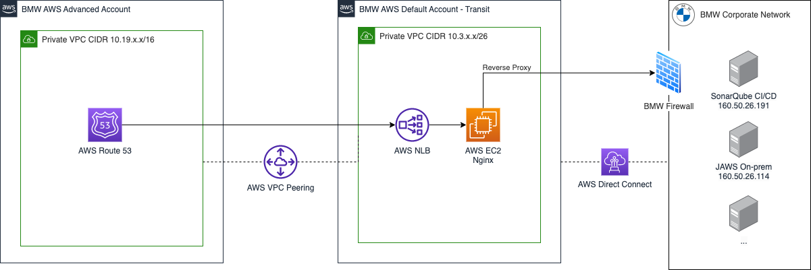

## About

This module is responsible to deploy NGINX as a reverse proxy for CAWE transit account.

If the proxy runs on port 443 TCP or an existing port and protocol combination, it is only needed to add on route53, therefore create a new module call (cawe-stack-route) or add to an existing Hosted zone.
If the proxy runs on a different port, a new entry needs to be added to the lb_listener_tg variable

## BMW Requirements

In order to reach BMW internal resrouces we need to request port whitelist. 
For that we need to open a Tufin request - https://tufin.bmwgroup.net

### Tufin Request Template 

**Subject**: Connection CAWE to SonarQube on-prem 
**Application Name / Justification**: We need to connected our AWS product account to Connected CICD SonarQube
on-premises. 
 
**Required Access** 

| Source       | Destination     | Service/Application Identity | Action |
|--------------|-----------------|------------------------------|--------|
| AWS VPC CIDR | IP Address CIDR | Port Number                  | Accept |

Example for Connected CI/CD SonarQube:

| Source        | Destination      | Service/Application Identity | Action |
|---------------|------------------|------------------------------|--------|
| 10.3.21.64/26 | 160.50.26.191/32 | TPC 443                      | Accept |

<!-- BEGIN_TF_DOCS -->
## Requirements

No requirements.

## Providers

| Name | Version |
|------|---------|
|  [aws](#provider\_aws) | n/a |
|  [aws.advanced-eu-central-1](#provider\_aws.advanced-eu-central-1) | n/a |
|  [aws.advanced-eu-west-1](#provider\_aws.advanced-eu-west-1) | n/a |

## Modules

No modules.

## Resources

| Name | Type |
|------|------|
| [aws_autoscaling_attachment.nginx](https://registry.terraform.io/providers/hashicorp/aws/latest/docs/resources/autoscaling_attachment) | resource |
| [aws_autoscaling_group.asg-nginx](https://registry.terraform.io/providers/hashicorp/aws/latest/docs/resources/autoscaling_group) | resource |
| [aws_autoscaling_policy.nginx-scale-down](https://registry.terraform.io/providers/hashicorp/aws/latest/docs/resources/autoscaling_policy) | resource |
| [aws_autoscaling_policy.nginx-scale-up](https://registry.terraform.io/providers/hashicorp/aws/latest/docs/resources/autoscaling_policy) | resource |
| [aws_cloudwatch_metric_alarm.nginx-scale-down](https://registry.terraform.io/providers/hashicorp/aws/latest/docs/resources/cloudwatch_metric_alarm) | resource |
| [aws_cloudwatch_metric_alarm.nginx-scale-up](https://registry.terraform.io/providers/hashicorp/aws/latest/docs/resources/cloudwatch_metric_alarm) | resource |
| [aws_iam_instance_profile.ssm_profile_role](https://registry.terraform.io/providers/hashicorp/aws/latest/docs/resources/iam_instance_profile) | resource |
| [aws_iam_role.ssm_profile_role](https://registry.terraform.io/providers/hashicorp/aws/latest/docs/resources/iam_role) | resource |
| [aws_iam_role_policy_attachment.ManagedInstanceCore](https://registry.terraform.io/providers/hashicorp/aws/latest/docs/resources/iam_role_policy_attachment) | resource |
| [aws_iam_role_policy_attachment.SSMAutomationRole](https://registry.terraform.io/providers/hashicorp/aws/latest/docs/resources/iam_role_policy_attachment) | resource |
| [aws_launch_template.nginx](https://registry.terraform.io/providers/hashicorp/aws/latest/docs/resources/launch_template) | resource |
| [aws_lb.direct_vpc1](https://registry.terraform.io/providers/hashicorp/aws/latest/docs/resources/lb) | resource |
| [aws_lb.direct_vpc2](https://registry.terraform.io/providers/hashicorp/aws/latest/docs/resources/lb) | resource |
| [aws_lb.nginx](https://registry.terraform.io/providers/hashicorp/aws/latest/docs/resources/lb) | resource |
| [aws_lb_listener.direct_vpc1](https://registry.terraform.io/providers/hashicorp/aws/latest/docs/resources/lb_listener) | resource |
| [aws_lb_listener.direct_vpc2](https://registry.terraform.io/providers/hashicorp/aws/latest/docs/resources/lb_listener) | resource |
| [aws_lb_listener.nginx](https://registry.terraform.io/providers/hashicorp/aws/latest/docs/resources/lb_listener) | resource |
| [aws_lb_target_group.direct_vpc1](https://registry.terraform.io/providers/hashicorp/aws/latest/docs/resources/lb_target_group) | resource |
| [aws_lb_target_group.direct_vpc2](https://registry.terraform.io/providers/hashicorp/aws/latest/docs/resources/lb_target_group) | resource |
| [aws_lb_target_group.nginx](https://registry.terraform.io/providers/hashicorp/aws/latest/docs/resources/lb_target_group) | resource |
| [aws_lb_target_group_attachment.direct_vpc1](https://registry.terraform.io/providers/hashicorp/aws/latest/docs/resources/lb_target_group_attachment) | resource |
| [aws_lb_target_group_attachment.direct_vpc2](https://registry.terraform.io/providers/hashicorp/aws/latest/docs/resources/lb_target_group_attachment) | resource |
| [aws_route53_record.default_records](https://registry.terraform.io/providers/hashicorp/aws/latest/docs/resources/route53_record) | resource |
| [aws_route53_record.direct_records_vpc1](https://registry.terraform.io/providers/hashicorp/aws/latest/docs/resources/route53_record) | resource |
| [aws_route53_record.direct_records_vpc2](https://registry.terraform.io/providers/hashicorp/aws/latest/docs/resources/route53_record) | resource |
| [aws_route53_record.github_enterprise](https://registry.terraform.io/providers/hashicorp/aws/latest/docs/resources/route53_record) | resource |
| [aws_route53_record.github_enterprise_all](https://registry.terraform.io/providers/hashicorp/aws/latest/docs/resources/route53_record) | resource |
| [aws_route53_record.keycloak](https://registry.terraform.io/providers/hashicorp/aws/latest/docs/resources/route53_record) | resource |
| [aws_route53_record.packages_orbit](https://registry.terraform.io/providers/hashicorp/aws/latest/docs/resources/route53_record) | resource |
| [aws_route53_record.registry-mirror](https://registry.terraform.io/providers/hashicorp/aws/latest/docs/resources/route53_record) | resource |
| [aws_route53_vpc_association_authorization.this_eu_central_1](https://registry.terraform.io/providers/hashicorp/aws/latest/docs/resources/route53_vpc_association_authorization) | resource |
| [aws_route53_vpc_association_authorization.this_eu_central_1_github_enterprise](https://registry.terraform.io/providers/hashicorp/aws/latest/docs/resources/route53_vpc_association_authorization) | resource |
| [aws_route53_vpc_association_authorization.this_eu_west_1](https://registry.terraform.io/providers/hashicorp/aws/latest/docs/resources/route53_vpc_association_authorization) | resource |
| [aws_route53_vpc_association_authorization.this_eu_west_1_github_enterprise](https://registry.terraform.io/providers/hashicorp/aws/latest/docs/resources/route53_vpc_association_authorization) | resource |
| [aws_route53_zone.default](https://registry.terraform.io/providers/hashicorp/aws/latest/docs/resources/route53_zone) | resource |
| [aws_route53_zone.github_enterprise](https://registry.terraform.io/providers/hashicorp/aws/latest/docs/resources/route53_zone) | resource |
| [aws_route53_zone_association.this_eu_central_1](https://registry.terraform.io/providers/hashicorp/aws/latest/docs/resources/route53_zone_association) | resource |
| [aws_route53_zone_association.this_eu_central_1_github_enterprise](https://registry.terraform.io/providers/hashicorp/aws/latest/docs/resources/route53_zone_association) | resource |
| [aws_route53_zone_association.this_eu_west_1](https://registry.terraform.io/providers/hashicorp/aws/latest/docs/resources/route53_zone_association) | resource |
| [aws_route53_zone_association.this_eu_west_1_github_enterprise](https://registry.terraform.io/providers/hashicorp/aws/latest/docs/resources/route53_zone_association) | resource |
| [aws_security_group.cdp_tools_sg](https://registry.terraform.io/providers/hashicorp/aws/latest/docs/resources/security_group) | resource |
| [aws_security_group.github_enterprise](https://registry.terraform.io/providers/hashicorp/aws/latest/docs/resources/security_group) | resource |
| [aws_security_group.load_balancer_nginx](https://registry.terraform.io/providers/hashicorp/aws/latest/docs/resources/security_group) | resource |
| [aws_security_group.load_balancer_nginx_health_check](https://registry.terraform.io/providers/hashicorp/aws/latest/docs/resources/security_group) | resource |
| [aws_security_group.load_balancer_vpc1](https://registry.terraform.io/providers/hashicorp/aws/latest/docs/resources/security_group) | resource |
| [aws_security_group.load_balancer_vpc2](https://registry.terraform.io/providers/hashicorp/aws/latest/docs/resources/security_group) | resource |
| [aws_vpc_endpoint.cdp_tools](https://registry.terraform.io/providers/hashicorp/aws/latest/docs/resources/vpc_endpoint) | resource |
| [aws_vpc_endpoint.github_enterprise](https://registry.terraform.io/providers/hashicorp/aws/latest/docs/resources/vpc_endpoint) | resource |
| [aws_ami.nginx_ami](https://registry.terraform.io/providers/hashicorp/aws/latest/docs/data-sources/ami) | data source |
| [aws_caller_identity.current](https://registry.terraform.io/providers/hashicorp/aws/latest/docs/data-sources/caller_identity) | data source |
| [aws_region.advanced-eu-central-1](https://registry.terraform.io/providers/hashicorp/aws/latest/docs/data-sources/region) | data source |
| [aws_region.advanced-eu-west-1](https://registry.terraform.io/providers/hashicorp/aws/latest/docs/data-sources/region) | data source |
| [aws_route53_zone.bmwgroup](https://registry.terraform.io/providers/hashicorp/aws/latest/docs/data-sources/route53_zone) | data source |
| [aws_route53_zone.hosted_zones](https://registry.terraform.io/providers/hashicorp/aws/latest/docs/data-sources/route53_zone) | data source |
| [aws_subnet.private_subnet_az3](https://registry.terraform.io/providers/hashicorp/aws/latest/docs/data-sources/subnet) | data source |
| [aws_subnets.advanced-eu-central-1](https://registry.terraform.io/providers/hashicorp/aws/latest/docs/data-sources/subnets) | data source |
| [aws_subnets.subnets_vpc1](https://registry.terraform.io/providers/hashicorp/aws/latest/docs/data-sources/subnets) | data source |
| [aws_subnets.subnets_vpc2](https://registry.terraform.io/providers/hashicorp/aws/latest/docs/data-sources/subnets) | data source |
| [aws_vpc.advanced-eu-central-1](https://registry.terraform.io/providers/hashicorp/aws/latest/docs/data-sources/vpc) | data source |
| [aws_vpc.advanced-eu-west-1](https://registry.terraform.io/providers/hashicorp/aws/latest/docs/data-sources/vpc) | data source |
| [aws_vpc.vpc1](https://registry.terraform.io/providers/hashicorp/aws/latest/docs/data-sources/vpc) | data source |
| [aws_vpc.vpc2](https://registry.terraform.io/providers/hashicorp/aws/latest/docs/data-sources/vpc) | data source |
| [aws_vpcs.transit_vpc](https://registry.terraform.io/providers/hashicorp/aws/latest/docs/data-sources/vpcs) | data source |

## Inputs

| Name | Description | Type | Default | Required |
|------|-------------|------|---------|:--------:|
|  [ami\_name](#input\_ami\_name) | The name to give to the copied AMI. | `string` | n/a | yes |
|  [autoscaling\_name](#input\_autoscaling\_name) | Name of the autoscaling group | `string` | n/a | yes |
|  [common\_tags](#input\_common\_tags) | Project common tags | <pre>object({     environment  = string     project_name = string   })</pre> | n/a | yes |
|  [desired\_capacity](#input\_desired\_capacity) | Max number of nginx replicas | `number` | n/a | yes |
|  [distribution](#input\_distribution) | Set Linux distribution | `string` | n/a | yes |
|  [dns\_prefixes\_vpc1](#input\_dns\_prefixes\_vpc1) | Records to be created for supported private hosted zones | <pre>list(object({     hosted_zone   = string     subdomain     = string     load_balancer = string   }))</pre> | n/a | yes |
|  [dns\_prefixes\_vpc2](#input\_dns\_prefixes\_vpc2) | Records to be created for supported private hosted zones | <pre>list(object({     hosted_zone   = string     subdomain     = string     load_balancer = string   }))</pre> | n/a | yes |
|  [environment](#input\_environment) | (Set by pipeline) Used to derive names of AWS resources. Use this to distinguish different enviroments | `string` | n/a | yes |
|  [group](#input\_group) | Naming prefix for all resources | `string` | n/a | yes |
|  [hosted\_zones](#input\_hosted\_zones) | List of supported private hosted zones | `list(string)` | n/a | yes |
|  [instance\_type](#input\_instance\_type) | Instance Type | `string` | n/a | yes |
|  [load\_balancers\_vpc1](#input\_load\_balancers\_vpc1) | List of Network Load Balancers to be created | `list(string)` | n/a | yes |
|  [load\_balancers\_vpc2](#input\_load\_balancers\_vpc2) | List of Network Load Balancers to be created | `list(string)` | n/a | yes |
|  [max\_nginx\_size](#input\_max\_nginx\_size) | Max number of nginx replicas | `number` | n/a | yes |
|  [min\_nginx\_size](#input\_min\_nginx\_size) | Min number of nginx replicas | `number` | n/a | yes |
|  [nginx\_instance\_profile\_name](#input\_nginx\_instance\_profile\_name) | n/a | `any` | n/a | yes |
|  [nginx\_ports](#input\_nginx\_ports) | List of default Nginx ports to be forwarded | `list(number)` | n/a | yes |
|  [nginx\_scale\_down\_threshold](#input\_nginx\_scale\_down\_threshold) | Bytes threshold to terminate some instances | `number` | n/a | yes |
|  [nginx\_scale\_up\_threshold](#input\_nginx\_scale\_up\_threshold) | Bytes threshold to spin up more instances | `number` | n/a | yes |
|  [project\_name](#input\_project\_name) | Project Name of this deployment | `string` | n/a | yes |
|  [region](#input\_region) | Region where nginx should be setup. | `string` | n/a | yes |
|  [target\_groups\_vpc1](#input\_target\_groups\_vpc1) | List of target groups to access BMW intranet services | <pre>list(object({     subdomain     = string     hosted_zone   = string     load_balancer = string     service_port  = string     service_ip    = string   }))</pre> | n/a | yes |
|  [target\_groups\_vpc2](#input\_target\_groups\_vpc2) | List of target groups to access BMW intranet services | <pre>list(object({     subdomain     = string     hosted_zone   = string     load_balancer = string     service_port  = string     service_ip    = string   }))</pre> | n/a | yes |
|  [vpc\_endpoint\_service\_name\_cdp\_tools](#input\_vpc\_endpoint\_service\_name\_cdp\_tools) | Endpoint service name for CDP Tools cluster | `string` | n/a | yes |
|  [vpc\_endpoint\_service\_name\_code\_connected](#input\_vpc\_endpoint\_service\_name\_code\_connected) | Endpoint service name for Code Connected GitHub | `string` | n/a | yes |
|  [worker\_connections](#input\_worker\_connections) | number of connections to be allowed to one nginx instance | `number` | `32767` | no |

## Outputs

| Name | Description |
|------|-------------|
|  [nlb\_dns](#output\_nlb\_dns) | n/a |
|  [zone\_id\_nlb](#output\_zone\_id\_nlb) | n/a |
<!-- END_TF_DOCS -->
